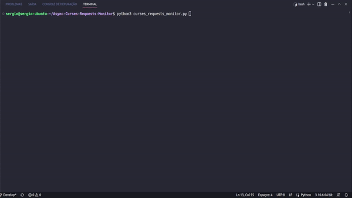

# Python Async Curses Monitor

This is a python async monitor using curses lib, the monitor are for requests (runs tqdm-like) and have colors support using regex.  
The only (optional) requirement for run this code is `aiohttp`, others libs are built-in.

